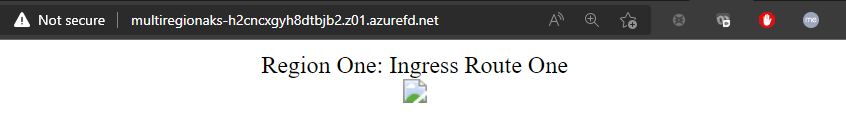
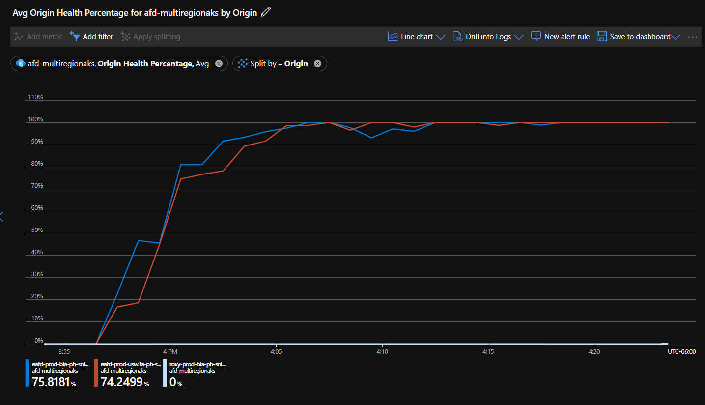

# Multi-region AKS with Azure Front Door and one public IP

## Features:
- Multiple region AKS deployment 
- Automatic load balancing between regions with Front Door global load balancing
- Private networking over the Azure backbone after the single Front Door entrypoint
- Nginx ingress controller deployed on each cluster with two sample apps and two ingress rules
- Bicep templates for all infrastructure resources

## Architecture

## Deployment 
Update the environment variables and run the commands in the [run.sh](./run.sh) file to deploy the solution. Pre-requisites include the following:
- Azure subscription
- A bash shell
- Azure CLI 
- kubectl
- helm 

To confirm the deployment has completed correctly for each region, visit the domain of the Azure Front Door instance. You should be routed to whichever region is closest to the Azure point-of-presence that you are accessing the URL from. The list of these locations is located in the docs [here](https://docs.microsoft.com/en-us/azure/cdn/cdn-pop-locations).

To ensure both regions are receiving traffic correctly check the Azure Front Door health metrics in the portal by navigating to the AFD resource -> Metrics, and choosing the `Origin Health Percentage` splitting by the `Origin`. Both origins should have ~100% health value once the AFD stabilizes. 

