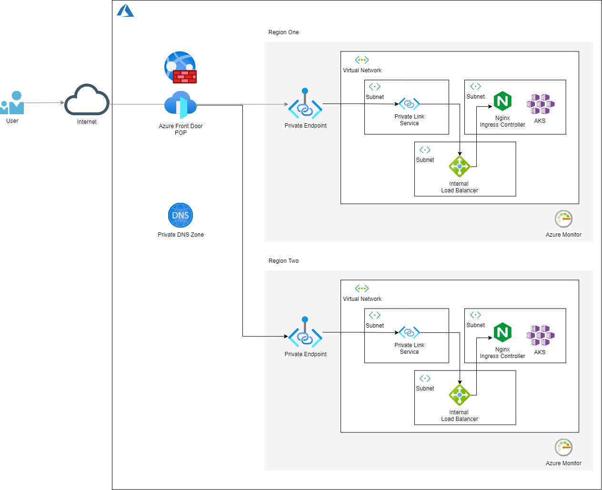

# Multi-region AKS with Azure Front Door and one public IP

## Features:
- Multiple region AKS deployment 
- Automatic load balancing between regions with Front Door global load balancing
- Private networking over the Azure backbone after the single Front Door entrypoint
- Nginx ingress controller deployed on each cluster with two sample apps and two ingress rules
- Bicep templates for all infrastructure resources

## Architecture

## Deployment 
Follow the instructions in the  [run.sh](./run.sh) file to deploy the solution.